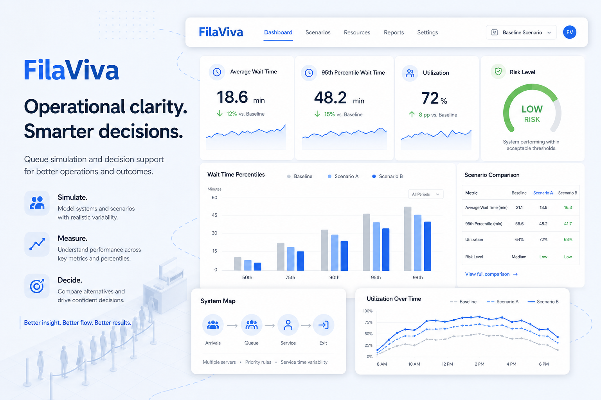
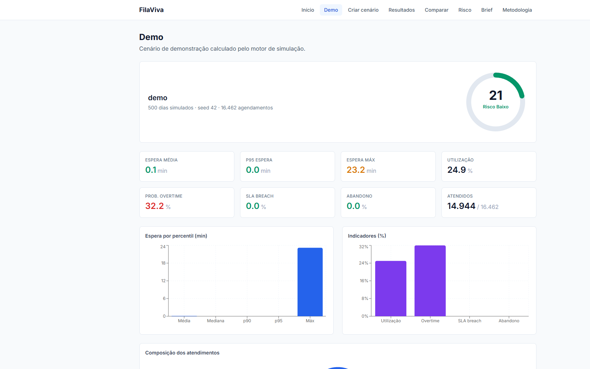

# FilaViva

**Simule capacidade, no-show e overbooking antes de mudar a operação real.**

[](https://filaviva-alpha.vercel.app/lab)
[](https://nextjs.org/)
[](https://fastapi.tiangolo.com/)
[](.github/workflows/ci.yml)

<p align="center">
  
</p>

## Live Demo

- **One-click lab (simular → risco → comparar):** https://filaviva-alpha.vercel.app/lab  
- Home: https://filaviva-alpha.vercel.app  
- GitHub homepage aponta para a demo pública.

> **Lab notice:** dados 100% sintéticos. Não é produção de call center e não substitui avaliação operacional real.

---

## Problema

Operações de atendimento mudam capacidade, duração e overbooking por intuição. Dashboards mostram o passado; raramente permitem testar o que aconteceria se a agenda mudasse amanhã — sem expor dados reais de clientes.

## Solução

O **FilaViva** é um simulador operacional de filas:

1. configura um cenário (servidores, no-show, walk-in, overbooking, SLA…);
2. gera demanda sintética reproduzível (seed);
3. simula dias operacionais com FIFO multi-servidor;
4. entrega KPIs, **risk score** explicável e comparação entre cenários.

## Principais funcionalidades

- **Scenario Builder** com presets
- **Demo / Results dashboard** (espera, utilização, overtime, SLA, abandono)
- **Risk & Reliability** (gauge + decomposição ponderada)
- **Comparison** (deltas, recomendação, trade-offs)
- **Executive Brief** por faixa de risco
- **Lab one-click** (`/lab`) com snapshot estático na Vercel

<p align="center">
  
</p>

## Arquitetura

```text
ScenarioConfig
  → AppointmentGenerator (synthetic, seeded)
  → Simulator (per-day FIFO multi-server)
  → Metrics + Risk Score
  → FastAPI  |  static snapshot.json
  → Next.js UI
```

Detalhes: [`docs/ARCHITECTURE.md`](./docs/ARCHITECTURE.md)

## Stack

| Camada | Tecnologia |
|---|---|
| UI | Next.js 15, React 19, TypeScript, Tailwind, Recharts |
| API | FastAPI, Pydantic v2, Uvicorn |
| Engine | NumPy (simulação discreta própria) |
| Demo pública | Snapshot JSON na Vercel |
| Testes / CI | pytest, ruff, ESLint, tsc, GitHub Actions |

## Demo local

### Pré-requisitos

- Node.js 20+
- Python 3.12+

### Frontend (demo estática — igual à Vercel)

```bash
cd frontend
npm install
npm run dev
```

Abra http://localhost:3000/lab

### Backend + UI ao vivo

```bash
# terminal 1 — a partir da RAIZ do repo
cd backend
python -m venv .venv
.venv\Scripts\activate
pip install -r requirements.txt
cd ..
backend\.venv\Scripts\python.exe -m uvicorn backend.main:app --reload --port 8000

# terminal 2
cd frontend
# garanta NEXT_PUBLIC_USE_STATIC_DEMO=0 ou remova a flag
npm run dev
```

> Uvicorn deve subir da **raiz** (`backend.main:app`). Subir de dentro de `backend/` quebra imports.

## Variáveis de ambiente

Veja `frontend/.env.example`:

| Variável | Uso |
|---|---|
| `NEXT_PUBLIC_USE_STATIC_DEMO` | `1` força snapshot (demo pública) |
| `NEXT_PUBLIC_API_BASE` | URL do FastAPI (default `http://localhost:8000`) |
| `CORS_ORIGINS` | origens extras no backend (CSV) |

## Testes

```bash
# backend
backend\.venv\Scripts\python.exe -m pytest backend/tests -q

# frontend
cd frontend
npm run lint
npm run typecheck
npm run build
```

Guia: [`docs/TESTING.md`](./docs/TESTING.md)

## Decisões técnicas e trade-offs

- Snapshot estático na Vercel em vez de API serverless pesada.
- Variabilidade do risco = `wait_std / SLA` (evita inflar score quando a média ≈ 0).
- `max_overtime_minutes` limita **início** de novos atendimentos após o expediente.
- Sem banco, sem auth — escopo lab.

Mais: [`docs/TECHNICAL_DECISIONS.md`](./docs/TECHNICAL_DECISIONS.md)

## Roadmap

- [ ] Série temporal / queue timeline (API + UI)
- [ ] Listagem de runs persistidos
- [ ] Testes HTTP (TestClient) e smoke E2E
- [ ] Atualizar screenshots após mudança do risk score (~7.0 no demo)

## Status atual

**Lab demo pública pronta** (Vercel + GitHub). Engine + UI locais com testes de domínio. Não é produto de call center.

## O que este projeto demonstra

- Modelagem de processo operacional (fila, capacidade, no-show)
- Simulação discreta reproduzível
- API tipada + UI decisória
- Comunicação de risco, trade-offs e limitações
- Deploy de demo confiável (static-first) para portfólio

## Como eu apresentaria em entrevista

1. Abrir `/lab` e narrar **simular → risco → comparar** em 60 segundos.  
2. Explicar por que o risk score é demonstrativo e como a variabilidade foi corrigida.  
3. Mostrar o trade-off: snapshot público vs engine live local.  
4. Citar antiescopo: sem PII, sem EHR, sem decisão individual automatizada.

Case study: [`docs/portfolio-case-study.md`](./docs/portfolio-case-study.md)

## Autor

**Felipe Alirio Baruja** — [@BarujaFe1](https://github.com/BarujaFe1) · [portfólio](https://barujafe.vercel.app/) · [LinkedIn](https://www.linkedin.com/in/barujafe/)

## Licença

MIT — ver [`LICENSE`](./LICENSE)
