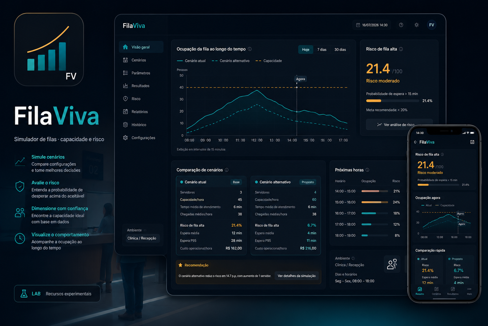
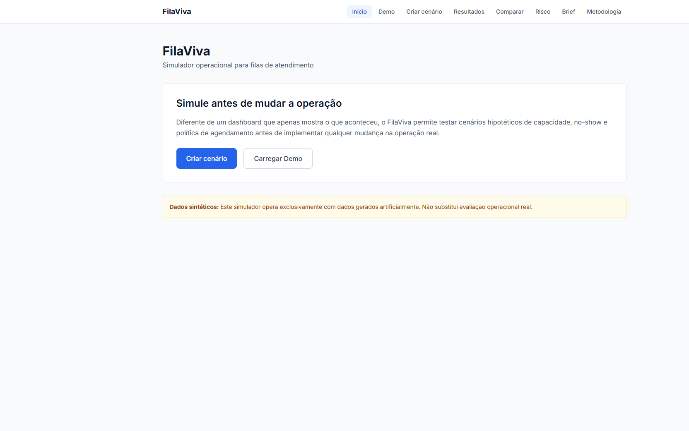
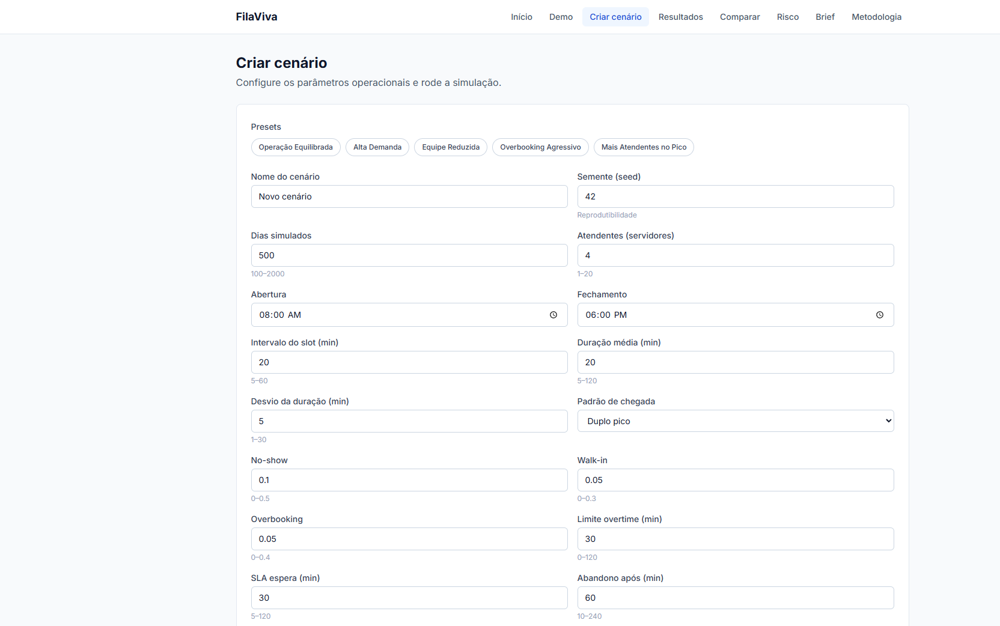
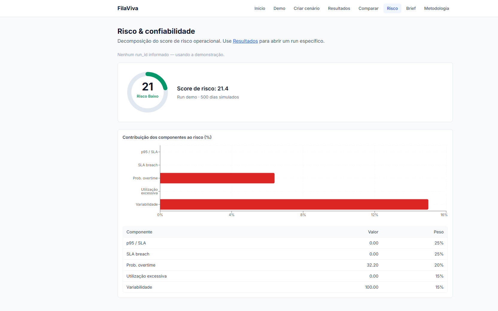
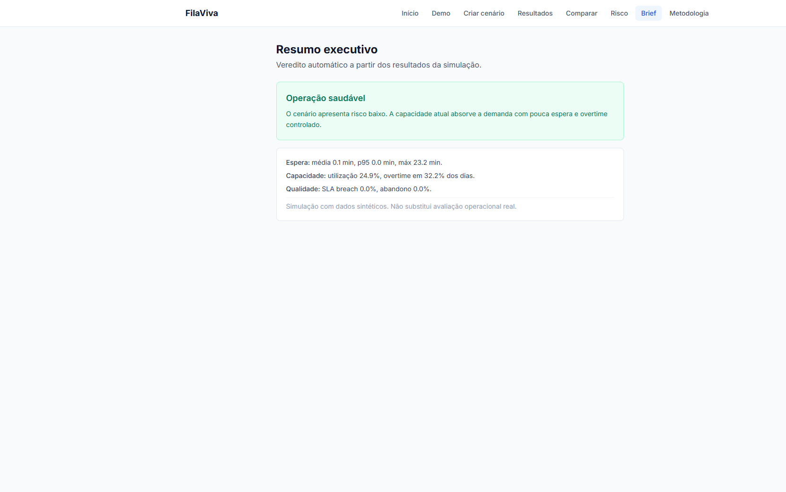
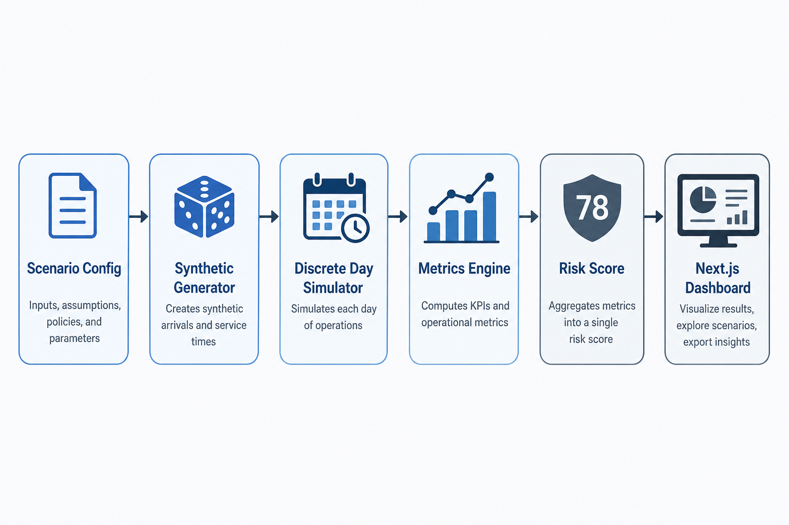

<div align="center">
  

  <h1>FilaViva</h1>

  <p><strong>Simulador operacional para filas de atendimento: cenários, métricas e risco antes de mudar a operação real.</strong></p>
  <p><strong>Operational queue simulator: scenario design, wait metrics and risk scoring before changing real operations.</strong></p>

  <p>
    <a href="#-visão-geral--overview">PT-BR / English Overview</a> •
    <a href="#-product-preview">Preview</a> •
    <a href="#-screenshots">Screenshots</a> •
    <a href="#-stack--tecnologias">Stack</a> •
    <a href="#-arquitetura--architecture">Architecture</a> •
    <a href="#-quick-start--início-rápido">Quick Start</a> •
    <a href="#-autor--author">Author</a>
  </p>

  <p>
    
    
    
    
    
    
  </p>
</div>

<p align="center">
  
</p>

---

## 🌐 Live Demo

**Demo pública (lab):** [https://filaviva.vercel.app](https://filaviva.vercel.app)

| Atalho | URL |
|---|---|
| One-click lab (simular → risco → comparar) | [/lab](https://filaviva.vercel.app/lab) |
| Dashboard Demo | [/demo](https://filaviva.vercel.app/demo) |
| Comparação | [/comparison](https://filaviva.vercel.app/comparison) |
| Risco | [/risk-reliability](https://filaviva.vercel.app/risk-reliability) |

> **Lab notice:** a demo pública usa um **snapshot pré-computado** (`frontend/public/demo/snapshot.json`) com dados sintéticos. Não é produção de call center. Simulações customizadas exigem o backend local.

Para regenerar o snapshot:
```bash
backend\.venv\Scripts\python.exe scripts\generate_public_snapshot.py
```

---

## 1. Visão Geral / Overview

O **FilaViva** (também referido como *Plantão Vivo*) é um simulador operacional para filas de atendimento. Ele permite configurar cenários hipotéticos de capacidade, no-show, overbooking e agenda, simular de **100 a 2000 dias** com dados sintéticos reproduzíveis e comparar métricas de espera, utilização, overtime e risco **antes** de alterar a operação real.

Diferente de um dashboard que apenas mostra o que aconteceu, o FilaViva cria uma camada de **simulação prévia** para decisões de capacidade e política de agendamento — sem usar dados reais de pacientes ou clientes.

O projeto foi desenvolvido por **Felipe Alirio Baruja** como peça de portfólio, combinando engenharia full-stack e modelagem operacional aplicada.

> **Responsible Simulation Notice**  
> O FilaViva opera exclusivamente com **dados sintéticos**. Ele **não** é sistema de prontuário, recomendador clínico, preditor individual nem ferramenta de decisão automatizada sobre pessoas. Não substitui avaliação operacional real.

---

## ✨ Product Preview

<p align="center">
  
</p>

O FilaViva apresenta uma experiência clara e decisória: Risk Gauge, KPIs de espera e capacidade, gráficos Recharts, decomposição de risco, comparação de cenários e resumo executivo com limitações explícitas.

---

## 2. Por que este projeto importa? / Why this project matters

* **Decisões operacionais ainda são intuitivas:** Capacidade, duração de atendimento e overbooking costumam ser ajustados sem simulação prévia.
* **Trade-offs precisam ser quantificados:** Reduzir espera pode aumentar utilização e overtime — o FilaViva torna esses deltas explícitos.
* **Dados sintéticos com responsabilidade:** O produto demonstra simulação útil sem expor PII ou dados clínicos reais.
* **Produto full-stack, não notebook:** Engine própria em Python + API FastAPI + frontend Next.js com fluxos ponta a ponta.

---

## 🧠 O diferencial do FilaViva / What makes FilaViva different

### Português
O FilaViva não é apenas um dashboard de fila. Ele combina geração sintética, simulação discreta multi-servidor, métricas operacionais e um risk score explicável em uma experiência navegável.

Ele mostra não apenas o resultado agregado, mas também:
- como o cenário foi configurado;
- quais métricas de espera e capacidade mudaram;
- como o risco se decompõe em componentes;
- qual cenário é preferível na comparação;
- quais limitações devem restringir a interpretação.

### English
FilaViva is not just a queue dashboard. It combines synthetic generation, discrete multi-server simulation, operational metrics and an explainable risk score into one navigable product.

It shows not only aggregate outcomes, but also:
- how the scenario was configured;
- which wait and capacity metrics changed;
- how risk breaks down into components;
- which scenario is preferable in comparison;
- which limitations must constrain interpretation.

---

## 🎯 Problema que resolve / The problem it solves

Em operações reais de atendimento, decisões costumam enfrentar:
- filas e atrasos em horários de pico;
- no-show e walk-ins imprevisíveis;
- overbooking agressivo ou conservador demais;
- utilização alta com overtime frequente;
- SLA de espera estourado;
- ausência de simulação antes de mudar a agenda;
- dashboards que descrevem o passado, mas não testam hipóteses.

O **FilaViva** cria uma camada de simulação entre a intuição operacional e a mudança real.

---

## 🧩 Proposta / Simulation Pipeline

O FilaViva processa um `ScenarioConfig` e entrega métricas agregadas, risk score e comparação entre cenários:

```txt
Scenario Config / Preset
  ↓
Synthetic appointment generation (seeded)
  ↓
Discrete-day multi-server FIFO simulation
  ↓
Metrics aggregation (wait, utilization, overtime, SLA, abandonment)
  ↓
Risk score + component breakdown
  ↓
Dashboard / Comparison / Executive Brief / Methodology
```

---

## 📸 Screenshots

<table>
  <tr>
    <td width="50%">
      
      <br />
      <sub><strong>Home</strong> — entrada do produto com CTAs para criar cenário ou carregar a demo.</sub>
    </td>
    <td width="50%">
      
      <br />
      <sub><strong>Demo Dashboard</strong> — Risk Gauge, KPIs e gráficos de espera, capacidade e composição.</sub>
    </td>
  </tr>
  <tr>
    <td width="50%">
      
      <br />
      <sub><strong>Scenario Builder</strong> — 17 parâmetros operacionais + presets prontos.</sub>
    </td>
    <td width="50%">
      
      <br />
      <sub><strong>Risk & Reliability</strong> — decomposição do score em 5 componentes ponderados.</sub>
    </td>
  </tr>
  <tr>
    <td width="50%">
      
      <br />
      <sub><strong>Executive Brief</strong> — veredito automático por faixa de risco com resumo operacional.</sub>
    </td>
    <td width="50%">
      
      <br />
      <sub><strong>Results</strong> — percentis de espera, indicadores % e composição de atendimentos.</sub>
    </td>
  </tr>
</table>

---

## 📌 Estudo de Caso / Case Study

### 📌 Estudo de Caso: Operação Equilibrada (Demo)
A demo padrão simula **500 dias** com seed `42`, 4 atendentes, padrão de chegada *double peak*, no-show de 10% e overbooking de 5%. O motor gera milhares de agendamentos sintéticos e calcula métricas agregadas — no run de referência, o risk score fica em torno de **21.4 (Baixo)**, com espera média muito baixa e overtime concentrado em parte dos dias.

A página de risco decompõe o score em `p95_normalized`, `sla_breach`, `overtime_probability`, `utilization_excess` e `variability`, com pesos 25/25/20/15/15.

### 📌 Case Study: Balanced Operation (Demo)
The default demo simulates **500 days** with seed `42`, 4 servers, *double peak* arrivals, 10% no-show and 5% overbooking. The engine generates thousands of synthetic appointments and aggregates metrics — in the reference run, risk score is about **21.4 (Low)**, with very low average wait and overtime concentrated on a subset of days.

The risk page decomposes the score into `p95_normalized`, `sla_breach`, `overtime_probability`, `utilization_excess` and `variability`, weighted 25/25/20/15/15.

---

## 🧭 Visual Story / Jornada do Usuário

```txt
1. Abrir a Home e escolher Demo ou Criar cenário
2. (Opcional) Aplicar um preset operacional
3. Rodar a simulação e abrir Resultados por run_id
4. Inspecionar KPIs, Risk Gauge e gráficos
5. Comparar baseline vs alternativa
6. Abrir Risco & Confiabilidade para decomposição
7. Ler o Brief executivo por faixa de risco
8. Consultar Metodologia e limitações
```

---

## ⚙️ Funcionalidades Principais / Core Features

### Scenario Builder
Formulário controlado com 17 campos (capacidade, agenda, no-show, walk-in, overbooking, SLA, abandono) e 5 presets da API.

### Simulation Dashboard
KPIs de espera (média/p95/máx), utilização, overtime, SLA breach, abandono e atendidos — com gráficos Recharts.

### Scenario Comparison
Dois cenários lado a lado, deltas absolutos/percentuais, recomendação, trade-off e notas de confiança.

### Risk & Reliability
Score 0–100 com gauge e breakdown dos componentes reais retornados por `/api/risk/components/{run_id}`.

### Executive Brief
Veredito automático: Baixo (&lt;40), Médio (40–70), Alto (&gt;70), com resumo textual responsável.

### Methodology
Exposição do `methodology.json` (distribuições, fórmula de risco, limitações).

---

## 🛠️ Stack / Tecnologias

### Frontend
- **Framework:** Next.js 15 (App Router) & React 19
- **Linguagem:** TypeScript (strict)
- **Estilização:** Tailwind CSS 3
- **Gráficos:** Recharts 2
- **Integração:** `fetch` via `NEXT_PUBLIC_API_BASE`

### Backend
- **Framework API:** FastAPI & Uvicorn (Python 3.12)
- **Modelagem:** Pydantic v2
- **Simulação:** Engine própria (NumPy)
- **Persistência:** JSON em `backend/data/results/`
- **Testes:** Pytest (engine)

---

## 🧱 Arquitetura / Architecture

```text
filaviva/
├── frontend/                 # Next.js 15 App Router
│   ├── src/app/              # Rotas (demo, builder, results, comparison, risk, brief…)
│   ├── src/components/       # UI (RunDashboard, ScenarioForm, charts, gauges)
│   ├── src/lib/              # Cliente HTTP da API
│   └── src/types/            # Contratos TypeScript
│
├── backend/                  # FastAPI + engine
│   ├── api/                  # Routers e schemas
│   ├── engine/               # Generator, simulator, metrics, risk_score
│   ├── data/                 # Demo, methodology, results
│   └── tests/                # Pytest
│
├── docs/                     # Metodologia, assumptions, case study
├── data/                     # Exemplos / sintéticos (.gitkeep)
├── scripts/                  # Utilitários
├── assets/                   # Ícone, hero, screenshots
└── README.md
```

---

## 🧱 Visual Architecture

<p align="center">
  
</p>

FilaViva follows a traceable operational flow: scenario config enters the pipeline, synthetic appointments are generated, each day is simulated with multi-server FIFO logic, metrics and risk are computed, then exposed through the Next.js dashboard.

---

## 🔁 Data Flow Pipeline

```txt
ScenarioConfig
  ↓
AppointmentGenerator (seeded synthetic demand)
  ↓
Simulator (per-day FIFO multi-server)
  ↓
Metrics (wait percentiles, utilization, overtime, SLA, abandonment)
  ↓
Risk Score + Components
  ↓
REST API → Next.js UI (Demo / Results / Compare / Risk / Brief)
```

---

## 🚀 Quick Start / Início Rápido

### Pré-requisitos
- **Node.js** 20+
- **Python** 3.12+
- **Git**

### Deploy público (Vercel)
O frontend em `frontend/` é deployável na Vercel com `NEXT_PUBLIC_USE_STATIC_DEMO=1` (já em `.env.production`). A demo pública **não depende** de FastAPI hospedado — o fluxo `/lab` lê o snapshot estático.

### 1. Backend FastAPI (a partir da raiz do monorepo)

> Importante: inicie o Uvicorn **da raiz** `filaviva/`, não de dentro de `backend/`, para o pacote `backend` ser importável.

```bash
cd backend
python -m venv .venv
.venv\Scripts\activate            # Windows
# source .venv/bin/activate       # Linux/macOS
pip install -r requirements.txt
cd ..
backend\.venv\Scripts\python.exe -m uvicorn backend.main:app --reload --port 8000
```

*API em [http://127.0.0.1:8000](http://127.0.0.1:8000) · docs em `/docs` · health em `/health`.*

### 2. Frontend Next.js

```bash
cd frontend
npm install
npm run dev
```

*Frontend em [http://localhost:3000](http://localhost:3000).*

Opcional: copie `frontend/.env.example` para `frontend/.env.local` e ajuste `NEXT_PUBLIC_API_BASE`.

### Demo
Abra a Home e clique em **Carregar Demo**, ou acesse `/demo`.

---

## 🧪 Scripts e Testes / Scripts and Testing

### Backend
```bash
cd backend
.venv\Scripts\python -m pytest
```

### Frontend
```bash
cd frontend
npm run lint
npx tsc --noEmit
npm run build
```

---

## 📊 Metodologia de Simulação / Simulation Methodology

- **Método:** simulação discreta por dia operacional
- **Fila:** FIFO multi-servidor
- **Duração de serviço:** Lognormal
- **Atraso de chegada:** Normal truncada
- **No-show:** Bernoulli
- **Walk-ins:** Poisson por dia
- **Reprodutibilidade:** seed inteira
- **Risk score (demonstrativo):**  
  `0.25·(p95/SLA) + 0.25·SLA_breach + 0.20·overtime + 0.15·utilization_excess + 0.15·variability` → escala 0–100

Detalhes em [`docs/methodology.md`](./docs/methodology.md) e [`docs/assumptions.md`](./docs/assumptions.md).

---

## 🛡️ Segurança, Ética e Boas Práticas

* **Sem PII / sem dados clínicos reais** — apenas sintéticos.
* **Avisos explícitos** na UI e no brief: não substitui avaliação operacional real.
* **Antiescopo claro:** não é EHR, recomendador clínico, preditor individual nem ERP.
* **Segredos fora do Git:** `.env*` ignorado; URL da API via `NEXT_PUBLIC_API_BASE`.

---

## 🧭 Roadmap do Produto

* **Feito:** engine + API + frontend funcional (Demo → Builder → Results → Comparison → Risk → Brief → Methodology)
* **Próximo:** timeline diária da fila (exige série temporal no backend)
* **Próximo:** listagem de runs persistidos
* **Próximo:** alinhar fórmula de variabilidade à documentação
* **Futuro:** exportação de relatório e presets salvos

---

## 💼 Valor para Portfólio / Portfolio Value

O FilaViva demonstra competências para **Analytics Engineering, Operations Research aplicada e Full-Stack Product Engineering**:
- modelagem de processos de fila;
- simulação reproduzível com seed;
- API tipada e UI decisória;
- comunicação de incerteza, trade-offs e limitações;
- responsabilidade analítica com dados sintéticos.

Case study: [`docs/portfolio-case-study.md`](./docs/portfolio-case-study.md).

---

## 📚 Documentação Complementar

- [docs/methodology.md](./docs/methodology.md) — algoritmo e distribuições
- [docs/assumptions.md](./docs/assumptions.md) — premissas e limites
- [docs/portfolio-case-study.md](./docs/portfolio-case-study.md) — narrativa de portfólio

---

## 🖼️ GitHub Social Preview

Imagem sugerida para social preview:
```txt
assets/social-preview.png
```
*Dimensão recomendada: 1280×640, &lt;1MB. Upload em: Repository Settings → Social Preview.*

---

## 🔖 GitHub Repository Metadata

### About sugerido
```txt
Operational queue simulator for service capacity scenarios — synthetic data, discrete simulation, risk scoring and scenario comparison (FastAPI + Next.js).
```

### Topics sugeridos
```txt
queue-simulation
operations-research
fastapi
nextjs
typescript
python
discrete-event-simulation
synthetic-data
risk-score
portfolio-project
recharts
operational-analytics
```

---

## 👤 Autor / Author

Desenvolvido por **Felipe Alirio Baruja**.

- **Portfolio:** [barujafe.vercel.app](https://barujafe.vercel.app/)
- **GitHub:** [@BarujaFe1](https://github.com/BarujaFe1)
- **LinkedIn:** [Gustavo Felipe Alirio Baruja](https://www.linkedin.com/in/barujafe/)

---

## 📄 Licença / License

MIT License. Copyright (c) 2026 Felipe Alirio Baruja.

Veja o arquivo [`LICENSE`](./LICENSE).
